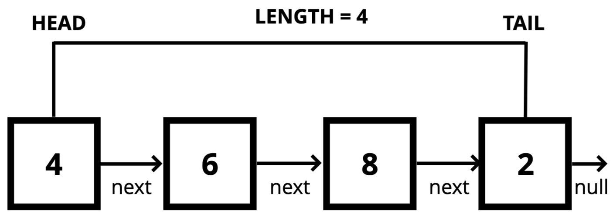
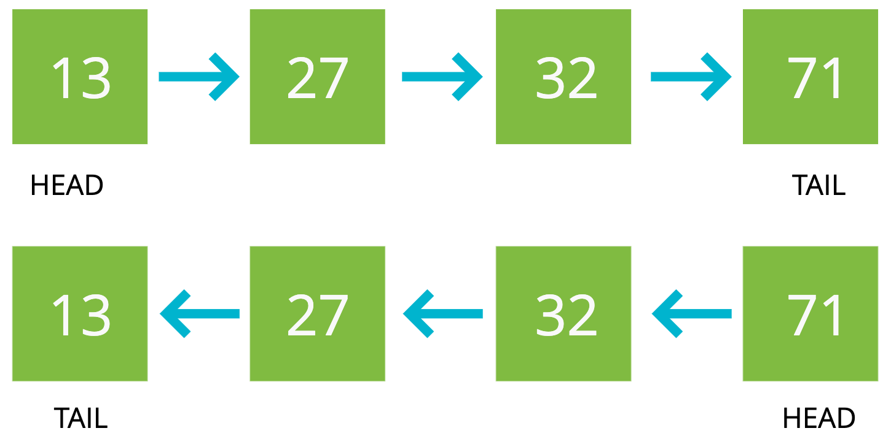

<details>
  <summary>Table of Contents</summary>
  <ol>
    <li>
      <a href="#data-structures">Data Structures</a>
      <ol>
        <li><a href="#stacks--queues">Stacks & Queues</a></li>
        <li><a href="#singly-linked-list">Singly Linked List</a></li>
        <li><a href="#doubly-linked-list">Doubly Linked List</a></li>
        <li><a href="#trees">Trees</a></li>
      </ol>
    </li>
    <li><a href="#sorting-algorithms">Sorting Algorithms</a>
      <ol>
        <li><a href="#bubble-sort">Bubble Sort</a></li>
      </ol>
    </li>
  </ol>
</details>

&nbsp;

## About The Project

- JavaScript Algorithms and Data Structures Masterclass
- The Missing Computer Science and Coding Interview Bootcamp
- [Colt Steele](https://github.com/Colt)
- [Colt Steele Slides](https://cs.slides.com/colt_steele/)
- [Function Timer Demo](https://rithmschool.github.io/function-timer-demo/)
- Went through this course way before I actively use GitHub. So I will be porting in notes from my pc from time to time.

&nbsp;

---

&nbsp;

## Data Structures

[MDN JavaScript Data Types and Data Structures](https://developer.mozilla.org/en-US/docs/Web/JavaScript/Data_structures)

- Data structures are collections of values, the relationships among them, and the functions or operations that can be applied to the data.
- Different data structures excel at different things. Some are highly specialized, while others (like arrays) are more generally used.

<table align="center">
  <tr>
    <th colspan="5">Data Structures</th>
  </tr>
  <tr>
    <th>Data Structures</th>
    <th>Insertion</th>
    <th>Removal</th>
    <th>Searching</th>
    <th>Access</th>
  </tr>
  <tr>
    <td>Singly Linked Lists</td>
    <td>O(1)</td>
    <td>O(1) or O(n)</td>
    <td>O(n)</td>
    <td>O(n)</td>
  </tr>
  <tr>
    <td>Doubly Linked Lists</td>
    <td>O(1)</td>
    <td>O(1)</td>
    <td>O(n)</td>
    <td>O(n)</td>
  </tr>
  <tr>
    <td>Stacks</td>
    <td>O(1)</td>
    <td>O(1)</td>
    <td>O(n)</td>
    <td>O(n)</td>
  </tr>
  <tr>
    <td>Queues</td>
    <td>O(1)</td>
    <td>O(1)</td>
    <td>O(n)</td>
    <td>O(n)</td>
  </tr>
  <tr>
    <td>Binary Search Tree</td>
    <td>O(log n)</td>
    <td></td>
    <td>O(log n)</td>
    <td></td>
  </tr>
  <tr>
    <td>Binary Heaps</td>
    <td>O(log n)</td>
    <td>O(log n)</td>
    <td>O(n)</td>
    <td></td>
  </tr>
  <tr>
    <td>Binary Heaps</td>
    <td>O(1)</td>
    <td>O(1)</td>
    <td></td>
    <td>O(1)</td>
  </tr>
</table>

&nbsp;

---

&nbsp;

### Stacks & Queues

- <b>Stacks: </b>LIFO
  - Managing function invocations
  - Undo / Redo
  - Routing (the history object)
  - Array/ Linked List Implementation

&nbsp;

> <b>Anne: </b>You did not set the .next of the popped value to null, is there a reason why?
>
> In your solution the popped node still has a connection to the stack via its next property right? I am a bit confused because when doing the linked list we always made sure to severe all connections

> <b>William: </b>Using pop you are severing the last node and that nodes next property is already null since nothing follows it.

> <b>Anne: </b>But it is never set to null, so it still points to the list!

> <b>Alan: </b>You're right in that the popped node object will have a reference to the next item in the stack But since we're returning its value--and not the node object itself--the object will never be referenced again (by a variable or as a property in another object). This means that it'll get picked up by the engine's garbage collector! So it can never affect the stack once popped (only its value property is returned), and <b>no memory leak takes place (there's no longer a reference to the node object)</b>

- <b>Queue: </b>FIFO

&nbsp;

---

&nbsp;

### Singly Linked List

```js
let first = new SinglyLinkedListNode('Hi');
first.next = new SinglyLinkedListNode('How');
first.next.next = new SinglyLinkedListNode('Are');
first.next.next.next = new SinglyLinkedListNode('You');
```



- A data structure that contains a head, tail and length property.
- Linked Lists consist of nodes, and each node has a value and a pointer to another node or null
- For removal, it will be the best at the start as compared to the end.
- Singly linked list is strong in insertion and removal. Arrays are good for random acccess.



&nbsp;

---

&nbsp;

### Doubly Linked List

- Almost identical to singly linked list except there is an additional pointer to previous nodes.
- Better than singly linked list for finding nodes and can be done in half the time!
- However, they do take up more memory considering the extra pointer.
- Doubly linked lists are used to implement other data structures and certain types of caches.

&nbsp;

---

&nbsp;

### Trees

```js
tree.root = new Node(10);
tree.root.right = new Node(15);
tree.root.left = new Node(7);
tree.root.left.right = new Node(9);
```

- <b>Trees: </b>A data structure that consists of nodes in a parent / child relationship.
  - <b>Lists: </b> linear & Trees - nonlinear.
  - <b>Root: </b> The top node in a tree.
  - <b>Child: </b>A node directly connected to another node when moving away from the Root.
  - <b>Parent: </b> The converse notion of a child.
  - <b>Siblings: </b>A group of nodes with the same parent.
  - <b>Leaf: </b> A node with no children.
  - <b>Edge: </b> The connection between one node and another.
    - Applications:
      - HTML DOM
      - Network Routing
      - Abstract Syntax Tree
      - Artificial Intelligence
      - Folders in Operating Systems
      - Computer File Systems

&nbsp;

- <b>Binary Trees</b>
  - Decision Trees (true / false)
  - Database Indicies
  - Sorting Algorithms

&nbsp;

- <b>Binary Search Trees</b>
  - Every parent node has at most two children.
  - Every node to the left of a parent node is always less than the parent.
  - Every node to the right of a parent node is always greater than the parent.

&nbsp;

- <b>Tree Traversal</b>
  - Visit every node once.
  - Breadth First Search
  - Depth First Search: PreOrder, PostOrder & InOrder

&nbsp;

- <b>Breath-First-Search VS Depth-First-Search:</b>
  - Time complexity is the same, space complexity depends on how wide is the tree.
  - BFS will take up a lot more space for queue is the tree is wide.
  - If it is a deep tree then DFS will take up more space.
  - InOrder: Used commonly with BST
  - PreOrder: Can be used to 'export' a tree strcture so that it is easily reconstructed or copied.

&nbsp;

---

&nbsp;

## Sorting Algorithms

- <b>Linear Search</b>
  - indexOf
  - includes
  - find
  - findIndex

&nbsp;

<table align="center">
  <tr><th colspan="3">Linear Search Big O</th></tr>
  <tr>
    <td>O(1) Best</td>
    <td>O(n) Average</td>
    <td>O(n) Worst</td>
  </tr>
  <tr><th colspan="3">Binary Search Big O</th></tr>
  <tr>
    <td>O(1) Best</td>
    <td colspan="2">O(log n) Worst and Average</td>
  </tr>
  <tr><th colspan="3"></th></tr>
  <tr><th colspan="3">Naive String Search O(nm)</th></tr>
  <tr><th colspan="3">KMP O(n + m) time, O(m) space</th></tr>
</table>

&nbsp;

- <b>Binary Search</b>
  - Binary search is a much faster form of search
  - Rather than eliminating one element at a time, you can eliminate half of the remaining elements at a time
  - Binary search only works on sorted arrays!

&nbsp;

- <b>Elementary Sorting Alogrithms</b>
  - <b>Bubble Sort:</b> A sorting algorithm where the largest values bubble up to the top!
  - <b>Selection Sort:</b> Similar to Bubble Sort, but instead of first placing large values into sorted position, it places small values into sorted position.
    - Selection Sort > Bubble Sort if you are in a situation whereby you want to <b>minimize the number of swaps.</b>
  - <b>Insertion Sort:</b> Builds up the sort by gradually creating a larger left half which is always sorted.
    - Insertion Sort is good for <b>online algorithm</b> to process input piece by piece.

&nbsp;

<table align="center">
  <tr><th colspan='5'>Intermediate Sorting Algorithms</th></tr>
  <tr>
    <th>Algorithm</th>
    <th>Time Complexity (Best)</th>
    <th>Time Complexity (Average)</th>
    <th>Time Complexity (Worst)</th>
    <th>Space Complexity</th>
  </tr>
  <tr>
    <td>Merge Sort</td>
    <td>O(n log n)</td>
    <td>O(n log n)</td>
    <td>O(n log n)</td>
    <td>O(n)</td>
  </tr>
  <tr>
    <td>Quick Sort</td>
    <td>O(n log n)</td>
    <td>O(n log n)</td>
    <td>O(n^2)</td>
    <td>O(log n)</td>
  </tr>
  <tr>
    <td>Radix Sort</td>
    <td>O(nk)</td>
    <td>O(nk)</td>
    <td>O(nk)</td>
    <td>O(n + k)</td>
  </tr>
</table>

&nbsp;

- <b>Intermediate Sorting Algorithms</b>
  - <b>Merge Sort: </b>It's a combination of two things - merging and sorting!
    - Exploits the fact that arrays of 0 or 1 element are always sorted.
    - Works by decomposing an array into smaller arrays of 0 or 1 elements, then building up a newly sorted array.
  - <b>Quick Sort:</b> Like merge sort, exploits the fact that arrays of 0 or 1 element are always sorted.
    - Works by selecting one element (called the <b>"pivot"</b>) and finding the index where the pivot should end up in the sorted array.
    - Once the pivot is positioned appropriately, quick sort can be applied on either side of the pivot.
    - The runtime of quick sort depends in part on how one selects the pivot.
    - Ideally, the <b>pivot should be chosen so that it's roughly the median value in the data set you're sorting.</b>
    - For simplicity, we'll always choose the pivot to be the first element (we'll talk about consequences of this later)
    - Worse Case [1,2,3,4,5,6,7,8,9,10,11,12,13,14,15]
  - <b>Radix Sort:</b>
    - Is a special sorting algorithm that works on lists of numbers.
    - It never makes comparisons between elements!
    - It exploits the fact that information about the size of a number is encoded in the number of digits. More digits means a bigger number!
    - It is a integer sort.
    - In <b>O(nk) n</b> refers to the length of array & <b>k</b> refers to the number of digits(average).

### Bubble Sort

```js
// ES5
function swap(arr, idx1, idx2) {
  var temp = arr[idx1];
  arr[idx1] = arr[idx2];
  arr[idx2] = temp;
}

// ES2015
const swap = (arr, idx1, idx2) => {
  [arr[idx1], arr[idx2]] = [arr[idx2], arr[idx1]];
};
```

- Optimize BubbleSort with the outer loop starting from the end.
- And use noSwaps for almost sorted array.

&nbsp;

---

&nbsp;
