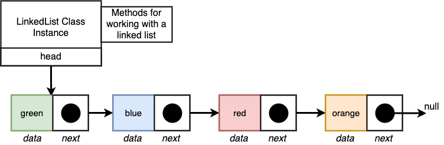
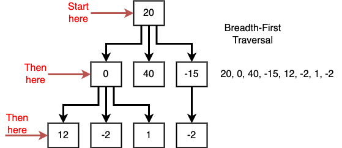
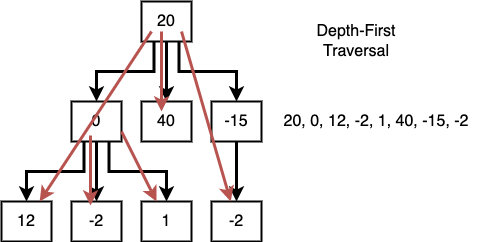
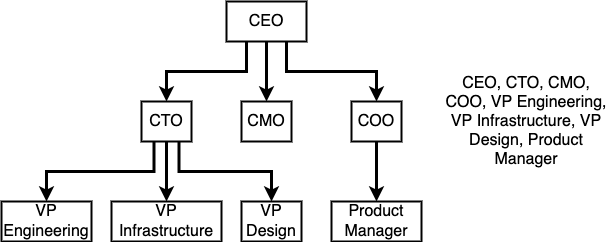
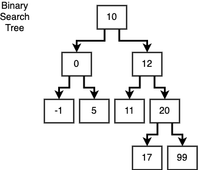
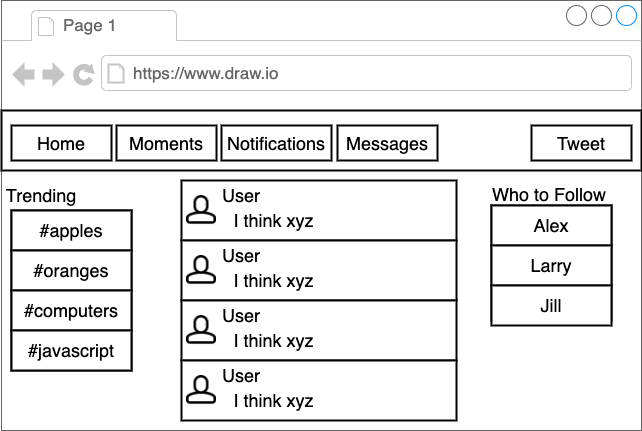
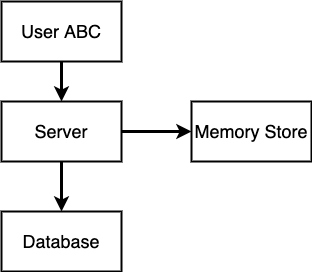
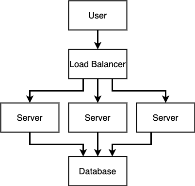

<details>
  <summary>Table of Contents</summary>
  <ol>
    <li><a href="#coding-interview">Coding Interview</a></li>
    <li><a href="#recursion-tips">Recursion Tips</a></li>
    <li><a href="#runtime-complexity">Runtime Complexity</a></li>
    <li><a href="#space-complexity">Space Complexity</a></li>
    <li><a href="#memoization">Memoization</a></li>
    <li><a href="#data-structures">Data Structures</a>
      <ol>
        <li><a href="#stacks--queues">Stacks & Queues</a></li>
        <li><a href="#linked-lists">Linked Lists</a></li>
        <li><a href="#trees">Trees</a></li>
      </ol>
    </li>
    <li><a href="#how-would-you-design-twitter">How would you design Twitter?</a></li>
    <li><a href="#sorting-algorithms">Sorting Algorithms</a></li>
  </ol>
</details>

&nbsp;

## About The Project

- The Coding Interview Bootcamp: Algorithms + Data Structures
- Ace your next Javascript coding interview by mastering data structures and algorithms.
- Tutorial for
- [Original Repo: AlgoCasts](https://github.com/StephenGrider/algocasts)
- [Stephen Grider](https://github.com/StephenGrider)
- Command to run a single test file: <code>npm test stephen-algocasts/vowels/test.js</code>

&nbsp;

---

&nbsp;

## Coding Interview

- <b>Contact Phase: </b>Work experience, side projects & social contacts
  - Talk to recruiter
  - Friend refers you
  - Submit resume online
- <b>Interview Phase: </b>Culture fit & Can you code?
  - Phone screen
  - Onsite interview
- <b>Evaluating coding ability</b>
  - Take-home assignment
  - Pair programming at a computer
  - Whiteboarding

&nbsp;

> "Write a program that prints the numbers from 1 to 100. But for multiples of three print “Fizz” instead of the number and for the multiples of five print “Buzz”. For numbers which are multiples of both three and five print “FizzBuzz”."

> A series of numbers in which each number ( Fibonacci number) is the sum of the two preceding numbers. The simplest is the series 1, 1, 2, 3, 5, 8, etc.

```js
function fib(n) {
  if (n < 2) return n;
  return fib(n - 1) + fib(n - 2);
}
```

&nbsp;

---

&nbsp;

### Recursion Tips

- Figure out the bare minimum pieces of information to represent your problem
- Give reasonable defaults to the bare minimum pieces of info
- Check the base case. Is there any work left to do? If not, return
- Do some work. Call your function again, making sure the arguments have changed in some fashion

&nbsp;

---

&nbsp;

## Runtime Complexity

- <b>Constant Time &mdash; 1 :</b> No matter how many elements we're working with, the algorithm/operation/whatever will always take the same amount of time
- <b>Logarithmic Time &mdash; log(n) :</b> You have this if doubling the number of elements you are iterating over doesn't double the amount of work. Always assume that searching operations are log(n)
- <b>Linear Time &mdash; n :</b> Iterating through all elements in a collection of data. If you see a for loop spanning from '0' to 'array.length', you probably have 'n', or linear runtime
- <b>Quasilinear Time &mdash; n \* log(n) :</b> You have this if doubling the number of elements you are iterating over doesn't double the amount of work. Always assume that any sorting operation is n\*log(n)
- <b>Quadratic Time &mdash; n<sup>2</sup> :</b> Every element in a collection has to be compared to every other element. 'The handshake problem'
- <b>Exponential Time &mdash; 2<sup>n</sup> :</b> If you add a _single_ element to a collection, the processing power required doubles

&nbsp;

|                     Identifying Runtime Complexity                     |                                                |
| :--------------------------------------------------------------------: | :--------------------------------------------: |
|     Iterating with a simple for loop through a single collection?      |                 Probably O(n)                  |
|                  Iterating through half a collection?                  | Still O(n). There are no constants in runtime. |
| Iterating through two _different_ collections with separate for loops? |                    O(n + m)                    |
|        Two nested for loops iterating over the same collection?        |                     O(n^2)                     |
|       Two nested for loops iterating over different collections?       |                    O(n\*m)                     |
|                                Sorting?                                |                  O(n\*log(n))                  |
|                       Searching a sorted array?                        |                   O(log(n))                    |

&nbsp;

---

&nbsp;

## Space Complexity

- How much more memory is required by doubling the problem set?

&nbsp;

---

&nbsp;

## Memoization

- Store the arguments of each function call along with the result. If the function is called again with the same arguments, return the precomputed result, rather than running the function again

&nbsp;

> <b>Steve: </b>Which version should we show the interviewer?

> <b>Stephen: </b>Steve - Great question. I'm going to give you an honest answer here, so honest that I might regret posting it in a public place in the future :)
>
> In an interview, you want to maximize the time spent showing your interviewer that you know what you talk about. If an interviewer asks you about a topic that you know very well, you're probably going to be well served to discuss that topic for as long as possible, rather than spitting out a quick answer and risk getting a followup question that you don't know much about.
>
> As such, for any question I recommend you always start with the simplest, most direct solution, even if it is not a performant or optimal solution. Your interviewer will inevitably ask you about some aspect of the solution, which gives you the opportunity to speak very intelligently about issues with that solution, and propose an alternative that solves those issues. Remember - that is gold in an interview, proving that you have the ability to critique some piece of code and recommend improvements to it.

&nbsp;

---

&nbsp;

> <b>Gary: </b>Is func.apply actually necessary?
>
> Hi, I was reading up on func.apply and in the context of memoize function, there doesn't seem to be any variables in the function scope that <code>fn</code> needs to access outside the given args, so <code>fn.apply(this, args)</code> doesn't seem necessary. The below seems to pass all the tests:

```js
function memoize(fn) {
  const cache = {};
  return function(...args) {
    if (cache[args]) return cache[args];
    const result = fn(...args); // here is the diff
    cache[args] = result;
    return result;
  }
}

function fib(n) {
  return (n < 2) ? n : fib(n-1) + fib(n-2);
```

> <b>Stephen: </b>Great question, but remember, when you use that spread operator you're writing ES6 code that will usually get transpiled to ES5. I took your code snippet and threw it into the babel repl at babeljs.io. Here's the output:

```js
'use strict';
function memoize(fn) {
  var cache = {};
  return function () {
    for (var _len = arguments.length, args = Array(_len), _key = 0; _key < _len; _key++) {
      args[_key] = arguments[_key];
    }
    if (cache[args]) return cache[args];
    var result = fn.apply(undefined, args); // here is the diff
    cache[args] = result;
    return result;
  };
}
```

> <code>fn(...args)</code> gets transpiled to <code>fn.apply(undefined, args)</code> :)

&nbsp;

---

&nbsp;

> <b>Glen: </b> Memoized fib(100) has constant r/t?
>
> So, would you say that the memoized version has constant r/t? I modified the last test to call fib(100) and it ran consistently in 1 or 2ms. Not truly constant, but pretty close. This is mind boggling!

> <b>Stephen: </b>It'd be linear runtime, not constant. We still have to do some amount more computation for each increase of the argument 'n'. Well to be precise - the first time running the fib algorithm with a memoized function would be linear. Any subsequent calculation where 'n' is less than the earlier call's value of 'n' would be constant runtime.
>
> Again, it comes down to the order in which you call the memoized function, here are some examples:

```js
fib(10); // linear runtime
fib(20); // linear runtime, we have to calculate from fib(11) to fib(20)

// However
fib(10); // linear runtime
fib(5); // constant, we already calculated fib(5) so just look up that value.
```

&nbsp;

---

&nbsp;

> <b>Alex: </b>Why is cache object not resetting?
>
> Shouldn't cache object be set to empty object every time we call fib() or memoize()? I can't understand why isn't this happening.

> <b>Stephen: </b>Each time we memoize a function we are creating a new cache object that is tied to the newly-memoized version of the function. We'd have to re-memoize the function to build a new cache.

&nbsp;

---

&nbsp;

## Data Structures

- Ways of organizing information with optimal 'runtime complexity' for adding or removing records
- Javascript natively implements several data structures (Array). You will still be asked about <i>inferior</i> data structures (Queue).

&nbsp;

### Stacks & Queues

- Queue : FIFO
- Stack : LIFO

> <b>Piyush: </b> Aren't stacks follow LIFO? So why do we have push and pop instead of unshift and shift? Could someone clear this out??

> <b>Shivam: </b>Yes, stacks follow LIFO. Also stacks have this principle - You insert and remove elements to the stack always from the same end. If you are using an array to implement your stack, then push and pop work on the right end of the array, unshift and shift work on the left end of the array. You can choose any one of the ends for your stack. Hope this clears your doubt.

> <b>Robinson: </b>For anyone reading this, Array.shift() and Array.Unshift() are O(n) functions while push and pop are O(1). You should always favor push and pop any day.
>
> For a quick explanation, imagine an array with 100 records inside. Each one of those records already have an index assigned. If you push and pop, you're not messing with the index of any of those records. O(1).
>
> When you shift and unshift however, the indexes are reassigned across the board. O(n).

&nbsp;

---

&nbsp;

### Linked Lists

&nbsp;



|     Previous      |        Reuse & refactor        |
| :---------------: | :----------------------------: |
| insertFirst(data) |       insertAt(data, 0)        |
| insertLast(data)  | insertAt(data, this.size() -1) |
|   removeFirst()   |          removeAt(0)           |
|   removeLast()    |   removeAt(this.size() - 1)    |
|    getFirst()     |            getAt(0)            |
|     getLast()     |     getAt(this.size() - 1)     |

- [MDN - Iteration protocols](https://developer.mozilla.org/en-US/docs/Web/JavaScript/Reference/Iteration_protocols)

> <b>Aniket: </b>How is <code>\*\[Symbol.iterator\]\(\)</code> getting invoked by for...of

> <b>Stephen: </b> For...Of loops are built to automatically look for a key of Symbol.Iterator.

&nbsp;

---

&nbsp;

### Trees

- <b>Breath-First-Search & Depth-First-Search</b>




&nbsp;



&nbsp;

- <b>Binary-Search-Tree</b>



> <b>Ray: </b>Handling insert in BST when data equals another node

> <b>Stephen: </b>Hi Ray - Great question, as you saw, there are contradictions on how to best handle this. I decided to just leave it out. If 'insertion' comes up in an interview, best to ask your interviewer how to handle duplicate values.

> <b>Thomas: </b>I chose to handle duplicate values in insert by doing... nothing.
>
> If you think about the purpose of a binary search tree, there's absolutely no valid reason to add a duplicate element (and by duplicate I do mean an element whose data is strictly identical to that of an existing node). It could return an error, although imo it'd make more sense to simply return the original node holding the value being duplicated (but then you'd have to return the newly created node in case of a normal insertion to be consistent with your return values).

&nbsp;

---

&nbsp;

### How would you design Twitter?

- <b>High level notes</b>
  - There is no right answer
  - Every interviewer will expect a different answer
  - Focus is usually on the data model
    - If interviewer doesn't have any preference
  - Don't mention specific technologies
  - Draw stuff
  - Talk



- <b>Process</b>
  - Identify Two Core Features
  - Possible Implementation
  - Identify and Address Difficulties
  - Solutions for scaling

&nbsp;

- <b>Tweeting:</b>
  - What does a tweet look like in the DB?
  - How to make the '#topic' and '@mention' systems?
  - How to implement retweets?
- <b>Feed:</b> How to show interesting tweets at top of feed?
- <b>Scaling for Users:</b> Caching & Deployment Options



- Store top tweets in memory store



- Load balancer with horizontal scaling

&nbsp;

---

&nbsp;

## Sorting Algorithms

|     Name      | Worst Case Runtime | Difficulty |
| :-----------: | :----------------: | :--------: |
|  BubbleSort   |   n<sup>2</sup>    |  easiest   |
| SelectionSort |   n<sup>2</sup>    |   easier   |
|   MergeSort   |     n\*log(n)      |   medium   |

&nbsp;

---

&nbsp;
